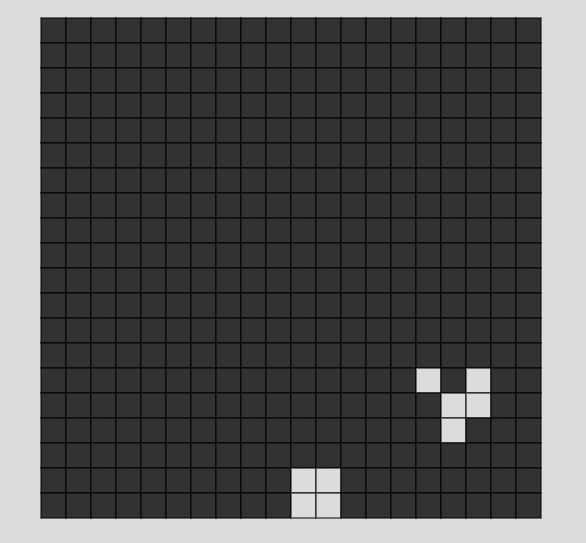

<h2>Introduction</h2>
I'm a computer science student, about to graduate. I love creative coding; check out my demos here. Writing is my other passion, and you can find my thoughts on my <a href="https://www.medium.com/@valholl">Medium</a> blog, I am on the lookout for topics to write on but I don't get to write as often as I had wish. Python and C are close to my heart; I know a little bit of many languages mentioned below</a>, I'm excited to learn Rust and solidity sometime in future. I enjoy exploring YouTube videos on tech.
 
To summarise I love computers.
  

<h2>✨✨</h2>

<table>
  <tr>
    <td>
       
      <a href="https://editor.p5js.org/barisodz/full/gHCs-pFAR">GameofLife</a> A cellular automaton based upon the conways game of life, the gif contains a glider a structure formed in the stable state of such a system.
    </td>
    <td>
      
      <a href="https://github.com/surbhitt/mini-projects/tree/main/VoronoiDiagram">Voronoi diagram</a>: a visualization technique used in artistic coding and graphics to generate terrains
    </td>
  </tr>
  <tr>
    <td colspan=2>
      
      <a href="https://github.com/surbhitt/mini-projects/tree/main/ImgView">ImgView</a>: a tool to view images using the native capabilities of the terminal (xterm truecolor).
    </td>
  </tr>
</table>

checkout for more such stuff <a href="https://github.com/surbhitt/mini-projects">mini-projects repo</a>

<h2>Medium</h2>

